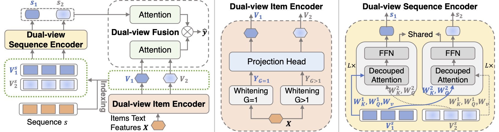

# DWSRec 

This is the official PyTorch implementation for the [paper](https://ojs.aaai.org/index.php/AAAI/article/view/28786):
> Lingzi Zhang, Xin Zhou, Zhiwei Zeng, Zhiqi Shen. Dual-View Whitening on Pre-trained Text Embeddings for Sequential Recommendation. AAAI 2024.

---
### Overview

Recent advances in sequential recommendation models have demonstrated the efficacy of integrating pre-trained text embeddings with item ID embeddings to achieve superior performance. However, our study takes a unique perspective by exclusively focusing on the untapped potential of text embeddings, obviating the need for ID embeddings. We begin by implementing a pre-processing strategy known as whitening, which effectively transforms the anisotropic semantic space of pre-trained text embeddings into an isotropic Gaussian distribution. Comprehensive experiments reveal that applying whitening to pre-trained text embeddings in sequential recommendation models significantly enhances performance. Yet, a full whitening operation might break the potential manifold of items with similar text semantics. To retain the original semantics while benefiting from the isotropy of the whitened text features, we propose a Dual-view Whitening method for Sequential Recommendation (DWSRec), which leverages both fully whitened and relaxed whitened item representations as dual views for effective recommendations. We further examine the advantages of our approach through both empirical and theoretical analyses. Experiments on three public benchmark datasets show that DWSRec outperforms state-of-the-art methods for sequential recommendation.



---
### Requirements

```
recbole==1.0.1
python==3.9.7
cudatoolkit==11.3.1
pytorch==1.11.0
```

---
### Download Datasets

Please download the processed datasets from [Google Drive](https://drive.google.com/drive/folders/1nb7ToGE-zxzewzhnbGbgIdi7InxOCGrZ?usp=sharing).

After unzipping, move `Arts/`, `Toys/`, `Tools/` to `dataset/`.

---
### Model Training

Train the DWSRec model:

```
CUDA_VISIBLE_DEVICES=1 python train.py --dataset=Arts --gpu_id=1 --fusion_type='sum' --learning_rate=0.0001 --engine='svd' --group=4 --layer_choice='mlp'
```

---
### Cite

If you find this repo useful, please cite

```bibtex
@inproceedings{zhang2024dual,
  title={Dual-View Whitening on Pre-trained Text Embeddings for Sequential Recommendation},
  author={Zhang, Lingzi and Zhou, Xin and Zeng, Zhiwei and Shen, Zhiqi},
  booktitle={Proceedings of the AAAI Conference on Artificial Intelligence},
  volume={38},
  number={8},
  pages={9332--9340},
  year={2024}
}
```

---
### Acknowledgement

The implementation is based on the [DIF-SR](https://github.com/AIM-SE/DIF-SR) and the open-source recommendation library [RecBole](https://github.com/RUCAIBox/RecBole).


